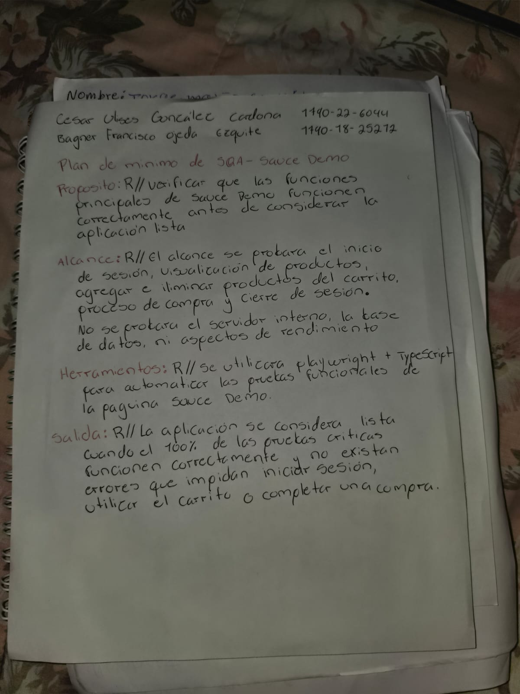

# SQA Plan mínimo - Sauce Demo

**Integrantes:**
- Cesar Ulises González Cardona
- Bagner Francisco Ojeda Esquite

## Propósito
Verificar que las funciones principales de Sauce Demo funcionen correctamente antes de considerar la aplicación lista, especialmente el inicio de sesión, el manejo de productos, el carrito y la compra.

## Alcance
Se probarán el inicio de sesión, visualización de productos, agregar y eliminar productos del carrito, proceso de compra y cierre de sesión. No se probará el servidor interno, la base de datos ni aspectos de rendimiento.

## Herramientas
Se utilizará Playwright con TypeScript para automatizar las pruebas funcionales de Sauce Demo.

## Criterios de salida
La aplicación se considerará lista cuando el 100% de las pruebas críticas funcionen correctamente y no existan errores que impidan iniciar sesión, utilizar el carrito o completar una compra.

## Evidencia del trabajo en equipo

Imagen de referencia del trabajo realizado por Bagner Francisco Ojeda Esquite y Cesar Ulises González Cardona para el SQA Plan mínimo de Sauce Demo.

